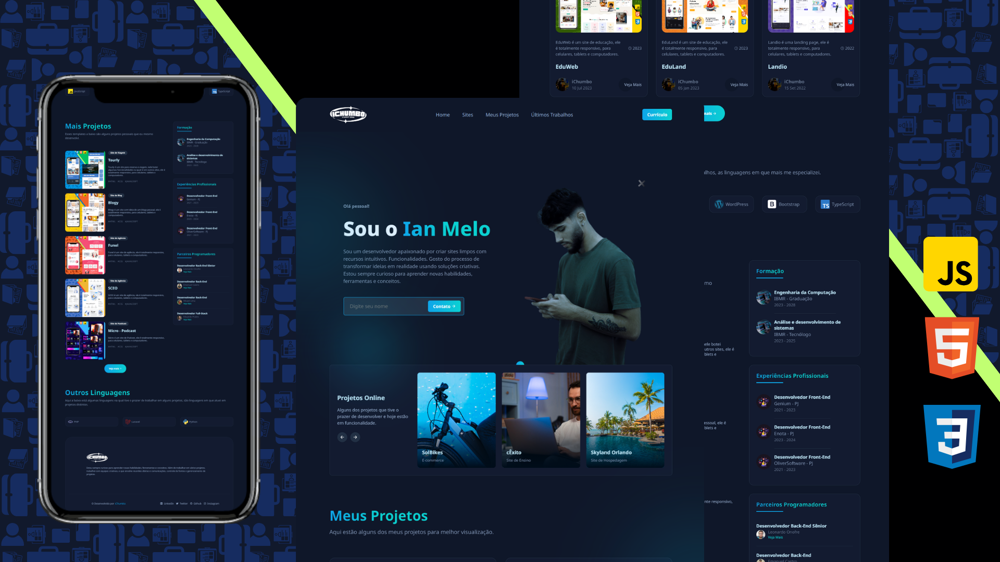

  
  

   
   

  <h2 align="center">Portfolio</h2>

  Aqui está meu Portfolio totalmente responsivo,  responsivo para todos os dispositivos, construído usando HTML, CSS e JavaScript.

  <a href="https://ichumbo-portfolio.netlify.app"><strong>➥ Site</strong></a>

 

### Demonstração

### Contato

Se você quiser entrar em contato comigo, pode entrar em contato comigo em [Linkedin](https://www.linkedin.com/in/ichumbo/).
